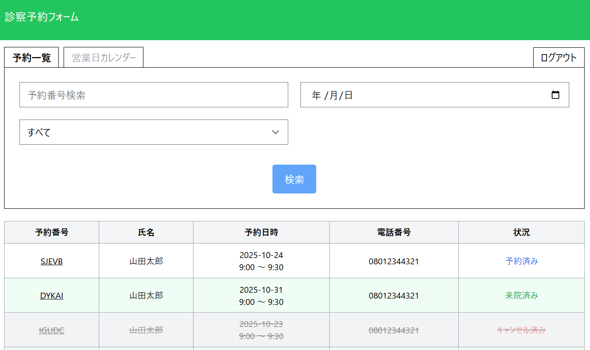
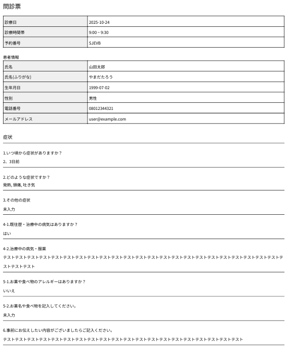
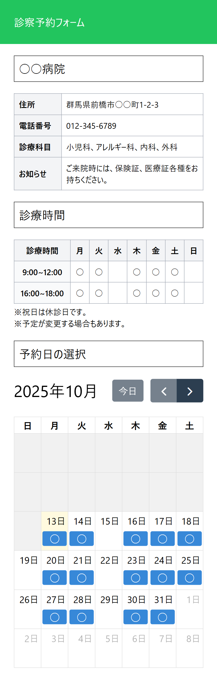
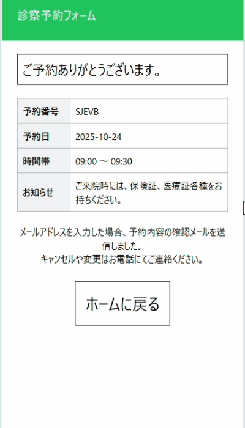

# ReservationSys（医療機関向け予約管理システム）

Laravel 12.31.1 を使用して開発した予約管理システムです。

患者はフォームから「氏名」「連絡先」「予約日時」「症状」などを入力するだけで簡単に予約が完了し、
送信された情報をもとに管理画面から 問診票の自動生成・ダウンロードが可能です。

管理者画面では予約一覧の確認・詳細表示に加え、
「予約キャンセル」「来院済み」などのステータス管理をワンクリックで行えます。
また、ログイン認証機能やアクセス制御を備えた安全設計により、患者データを安心して取り扱うことができます。

フロントエンドは Blade + Tailwind CSS によるシンプルで直感的なUIで構築し、
JavaScriptによるバリデーションや動的処理を組み込むことで、ユーザー体験を向上させています。

---

## 開発背景
日常的に使われる「予約システム」の仕組みに興味を持ち、
実際に自分で構築してみたいと考えたことが開発のきっかけです。

以前からPHPを扱っていたため、
学習コストを抑えつつ本格的なWebアプリケーション開発が可能なLaravelを採用しました。

「フォーム入力 → データの登録 → 管理画面で確認」といった基本的な流れを
自分の手で実装することで、Webアプリケーションの構造を理解することを目的としています。

---

## 技術スタック

**バックエンド** | PHP 8.4 / Laravel 12 
**フロントエンド** | Blade / Tailwind CSS / JavaScript 
**データベース** | MySQL 8.0.32 
**環境構築** | Docker 
**テスト** | PHPUnit 
**メール機能**  Mailpit 
**認証** | Laravel Breeze

| **バックエンド** | PHP 8.4 / Laravel 12
| **フロントエンド** | Blade / Tailwind CSS / JavaScript
| **データベース** | MySQL 8.0.32
| **環境構築** | Docker
| **テスト** | PHPUnit
| **メール機能**  Mailpit
| **認証** | Laravel Breeze

---

## 主な機能
### 患者用予約フォーム
- 名前・連絡先・予約日時・症状などの入力
- 入力チェック（バリデーション）
- 予約完了メール通知

### 管理者画面
- 予約一覧・詳細の閲覧
- 問診票のPDF自動生成・ダウンロード
- ステータス管理（予約済み・キャンセル・来院済み）
- 営業日カレンダー管理（予約可能日設定）

### 認証機能
- 管理者ログイン／ログアウト
- 認証済みユーザーのみが管理画面にアクセス可能

---

## 画面イメージ

## 管理画面

### 予約一覧
<<<<<<< HEAD
<table>
<tr>
  <td valign="top">
    予約一覧 
     
  </td>
  <td valign="top">
    患者別詳細ページ 
     
  </td>
    <td valign="top">
    PDFダウンロード問診票 
    
  </td>
</tr>
<tr>
    <td valign="top">
    営業日指定カレンダー 
    
  </td>
  </tr>
</table>

## 患者用画面
<table>
<tr>
  <td valign="top">
    予約日指定ページ 
     
  </td>
  <td valign="top">
    患者フォーム送信から完了（GIF） 
 
  </td>
</tr>
</table>

### 患者別詳細ページ

### PDF ダウンロード問診票

### 営業日指定カレンダー

## 患者用画面

### 予約日指定ページ

### 患者フォーム送信から完了（GIF）

>>>>>>> 07efb50b1dfaba9eeccf18f54e7322a298574f97
